# _```Data``` and ```time```_

* **In JavaScript, date and time are represented by the Date object. The Date object
provides the date and time information and also provides various methods.
A JavaScript date defines the EcmaScript epoch that represents milliseconds
since 1 January 1970 UTC. This date and time is the same as the UNIX epoch
(predominant base value for computer-recorded date and time values).**

>**Creating Date Objects
There are four ways to create a date object.
```•new Date()```
```•new Date(milliseconds)```
```•new Date(Date string)```
```•new Date(year, month, day, hours, minutes, seconds, ```
milliseconds)**

                                      new Date()
**You can create a date object using the new Date() constructor. For example,**
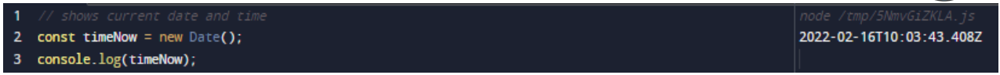
```sh 
                                new Date(milliseconds)
```
**A Date object contains a number representing milliseconds 
since January 1, 1970 UTC. New Date(milliseconds) Creates a 
new Date object by adding milliseconds to the zero time. For 
example,**
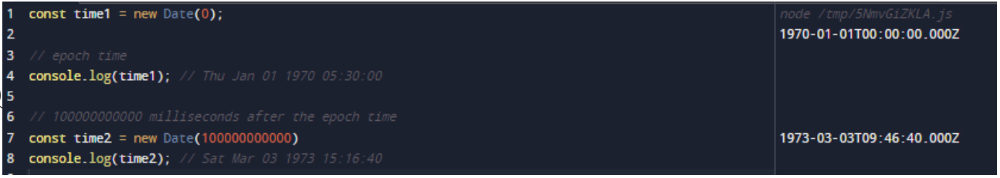
```sh
                              new Date (date string)
```
```New Date``` - **(date string) creates a new date object from the date string.In JavaScript, there 
are generally three date input formats. ISO Date Formats You can create a date object by 
passing ISO date formats. For example**
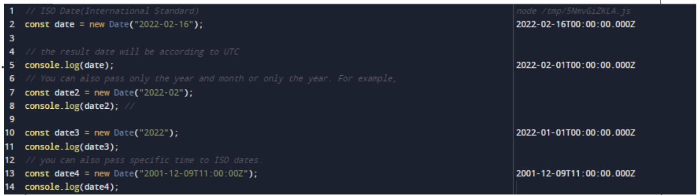
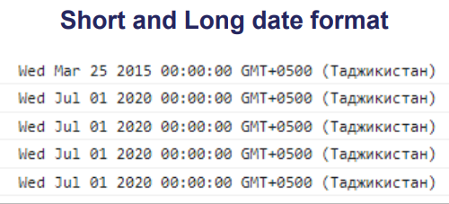
```sh
        new Date (year, month, day, hours, minutes, seconds, milliseconds)
```
**new Date(year, month,...) creates a new date object with the specified date 
and time. For example,**
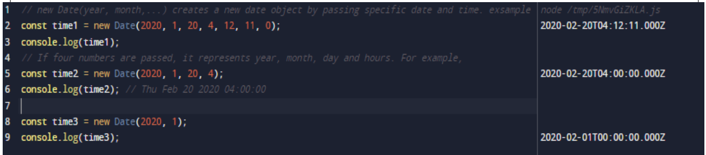
```Note:``` **If you pass only one argument, it will count as milliseconds. 
Therefore, to use this date format, you must pass two arguments. In 
JavaScript, months are counted from 0 to 11. January is 0 and 
December is 11**

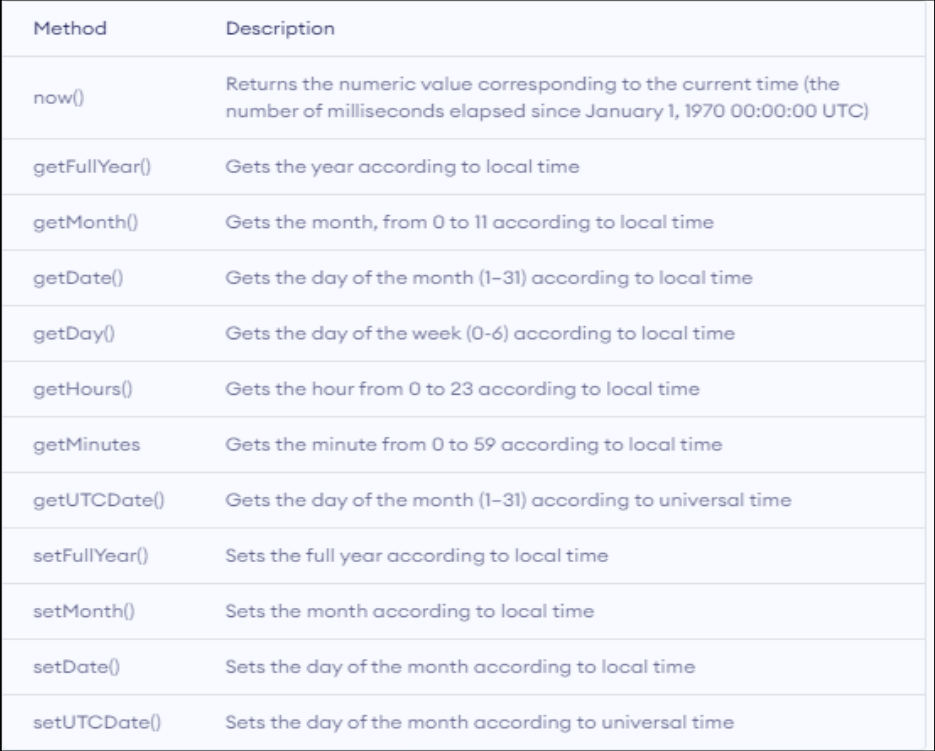
```sh
                                     now()
```
**```Date.now()``` returns the number of milliseconds since January 1, 1970.**
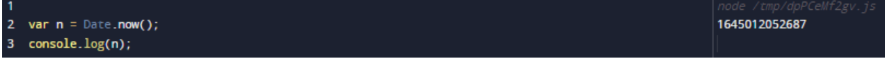
```sh
                                 getFullYear()
```
**```getFullYear()``` returns the full year of a date (4 digits).**
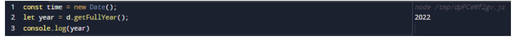
```sh
                                  getMonth()
```
**```getMonth()``` returns the month (0 to 11) of the date. January = 0, February = 1,..**
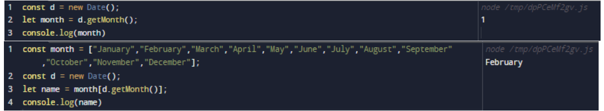
```sh
                                 getDate()
```
**The ```getDate()``` method returns the day of the month (1 to 31) of the date.**
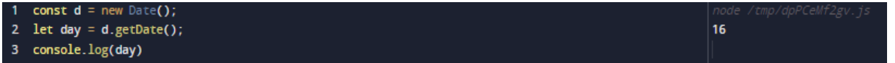
```sh
getDay()
```
**The ```getDay()``` method returns the day of the week (0 to 6) of the date. Sunday = 0, Monday = 1,**
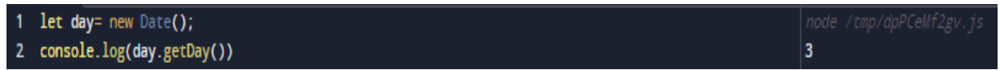
```sh
                                getHours()
```
```getHours()``` **returns the hours (0 to 23) of a date.**
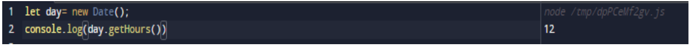
```sh
getMinutes
```
```getMinutes()``` **returns the minutes (0 to 59) of a date**
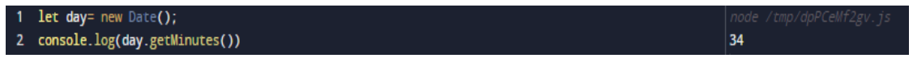
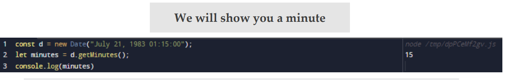
```sh
getUTCDate()
```
```getUTCDate()``` **returns the day of the month (1 to 31) of a date object.**
```getUTCDate()``` **returns the date in UTC.**
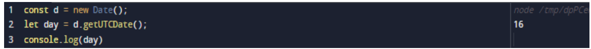
```sh
setFullYear()
```
```setFullYear()``` **sets the year of the date.**
```setFullYear()``` **can also set the month and day**
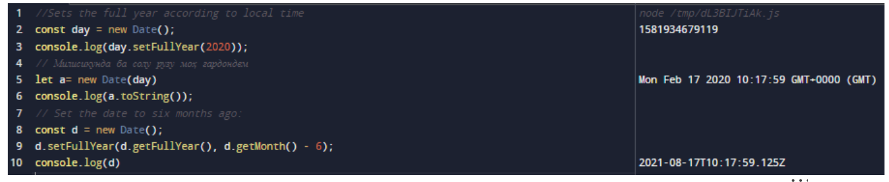
```sh
setMonth()
```
The ```setMonth()``` **method sets the month of the date object.**
**This method can also be used to set the day of the month**
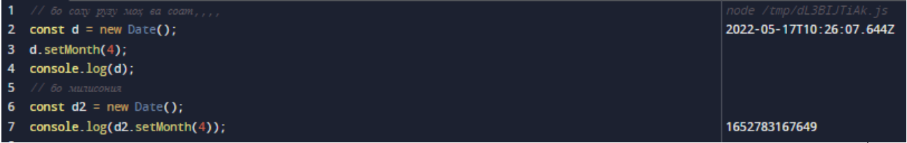
```sh
setDate()
```
```setDate()``` **sets the day month of the date.**
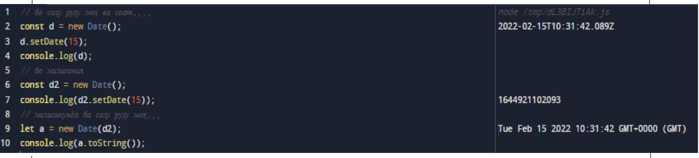
```sh
setUTCDate()
```
**The ```setUTCDate()``` method sets the date of the Date object according to UTC.**
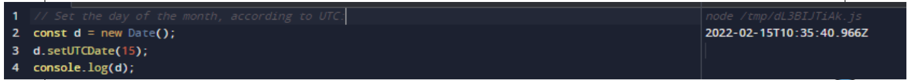

# Rahmat baroi dikkataton! 